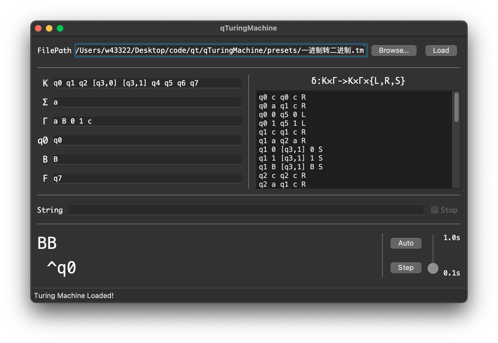
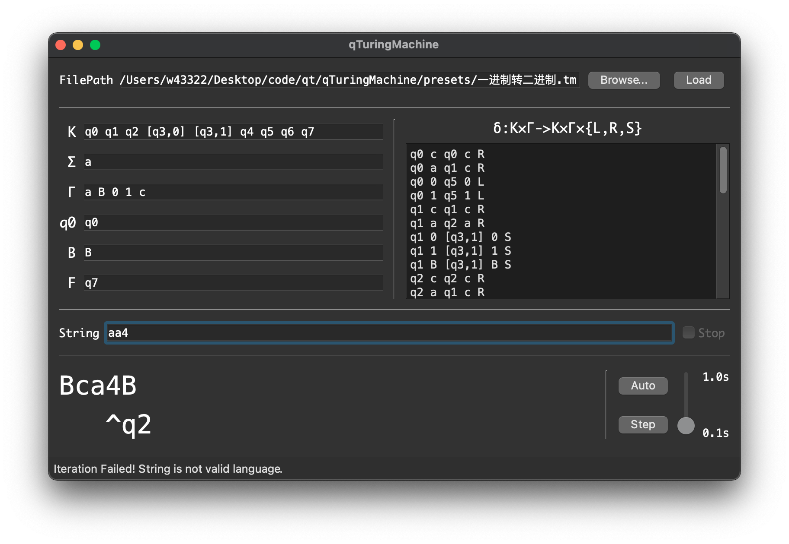
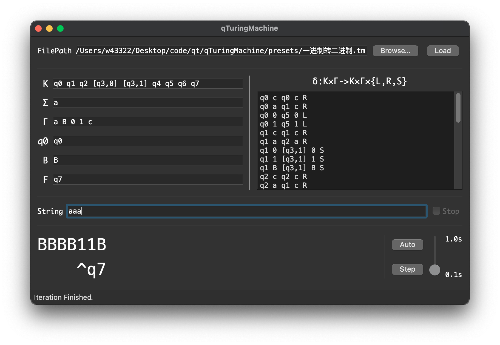
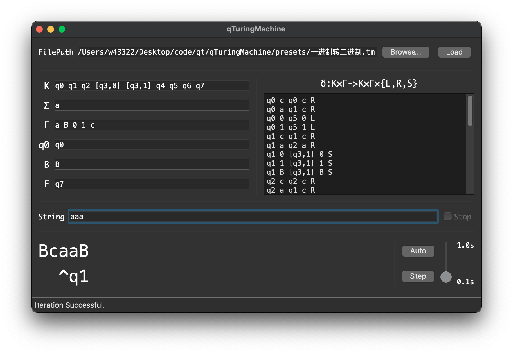

# qTuringMachine

## 这是一个东北大学2020级计算机学院《计算理论》课的课设。

### 1.简介

&emsp;&emsp;本程序使用Qt/C++编写，可以跨平台编译，在Windows 10 x64、macOS Big Sur以及Linux上都能正常编译。图灵机内部用stl的set和map实现，字符串用QString类储存。

&emsp;&emsp;本程序可以加载任意单带图灵机的预设，并针对所给定的字符串来模拟运行结果，支持逐步查看和自动运行。

&emsp;&emsp;本程序内置了5个图灵机预设，分别对应课件上“4.1 图灵机模型”中所给出的5个图灵机，它们分别是：

*  $n个0 \\_ n个1.tm$ ，接收的语言为  $L(m)= \\{ 0^n1^n \vert \geq1 \\}$

*  $wcw.tm$ ，接收的语言为  $L(m)= \\{ wcw \vert w \in\{a,b\}^+ \\}$

*  $log2(n).tm$ ，用来计算自然数  $a^n$ 以2为底的对数  $b^m(m=\log_2n)$

*  $m-n.tm$ ，用来计算两个自然数m、n的减法：  $res=m-min(n,m)$

*  $一进制转二进制.tm$ ，用来把一进制自然数  $a^n$ 转换成二进制数  $\\{ 0,1 \\}^+$

### 2.使用方法

&emsp;&emsp;打开软件后，点击“Browse...”按钮选择一个图灵机预设（后缀为 $.tm$ ），之后点击“Load”按钮载入该图灵机。成功后状态应如下图。

&emsp;&emsp;载入图灵机后，在String后面的输入框中输入想要的字符串，字符串应该会在下面实时更新。

&emsp;&emsp;点击“Auto”按钮或者“Step”按钮来运行图灵机。在Auto状态下，可以用右边的滑块来控制运行速度，用上面的“Stop”按钮来停止自动运行。

#### 在运行过程中：

&emsp;&emsp;如果遇到了不合法的字符串，下方状态栏会显示“Iteration Failed! String is not valid language.”；

&emsp;&emsp;如果已经到达了终止状态，下方状态栏会显示“Iteration Finished.”

&emsp;&emsp;如果成功进行状态转移，且尚未达到终止状态，下方状态栏会显示“Iteration Successful.”；

&emsp;&emsp;无论何时，在输入框内对字符串进行任意修改都可以重置图灵机到初始状态  $q0$ 。

## 2021年12月16日
